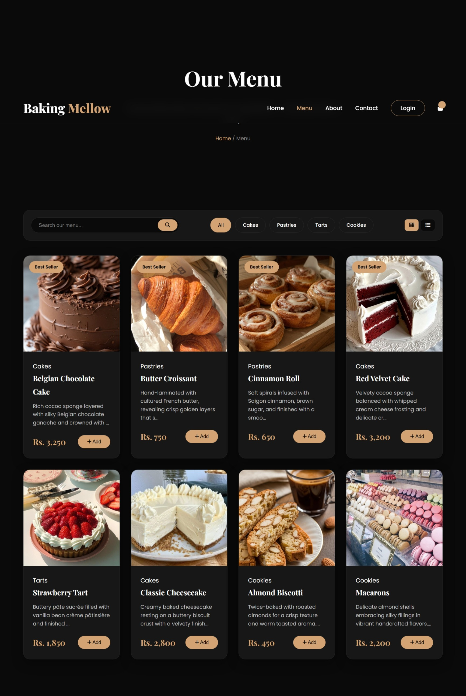
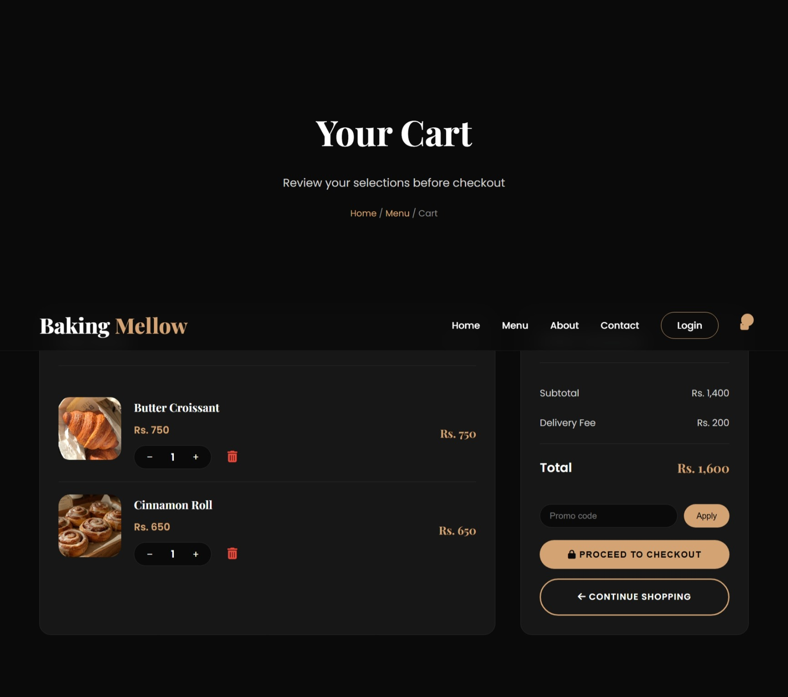
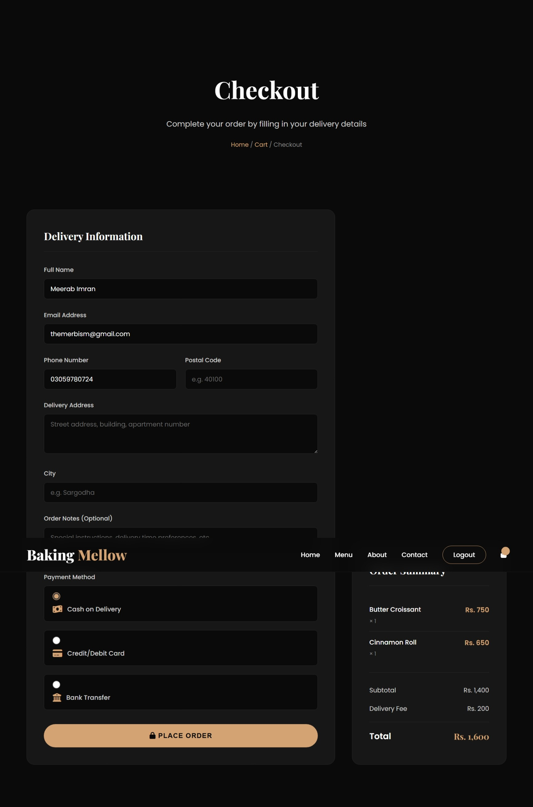
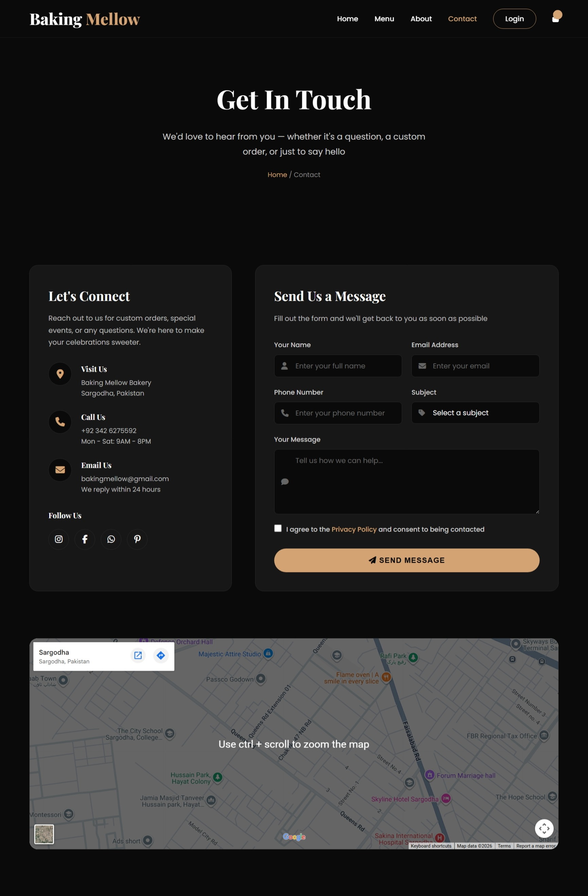
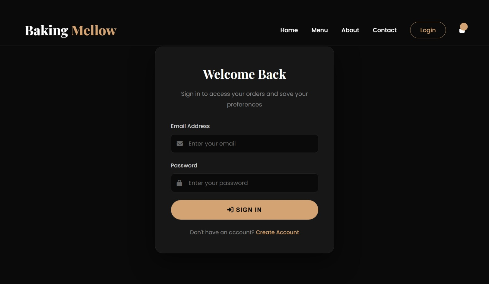
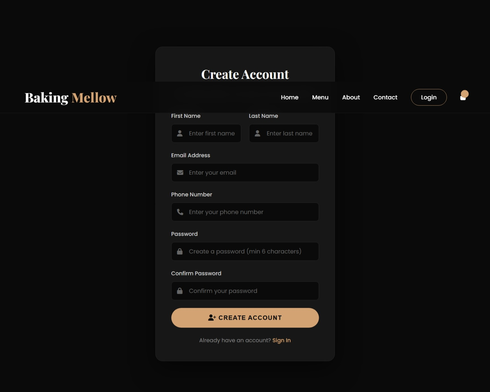

 # 🧁 Baking Mellow – Premium Bakery E-Commerce Platform


**Baking Mellow** is a full-stack, responsive e-commerce platform built for a premium bakery. Featuring an elegant dark-mode design with warm beige accents, it provides a seamless and immersive experience for customers to browse, customize quantities, apply promo codes, and securely place orders.

> **Tech Stack:** PHP, MySQL, JavaScript, HTML5, CSS3, FontAwesome, AOS (Animate On Scroll)

---

## 🌐 Live Demo

You can visit the live website here:  
👉 **[https://bakingmellow.infinityfreeapp.com](https://bakingmellow.infinityfreeapp.com)**  
*(Note: DNS propagation may take up to 72 hours. If the link doesn't load immediately, you can view the site using the direct IP address: `http://185.27.134.160`)*

---

## 📸 Page Screenshots

### 🏠 Home Page

*A stunning dark hero section featuring the signature tagline, a category collection, best-seller cards, and a newsletter subscription area.*

### 📋 Menu Page

*A fully dynamic menu powered by MySQL. Features a search bar, category filters, a grid/list view toggle, and a seamless "Add to Cart" system.*

### 🛒 Shopping Cart

*A persistent cart stored in the browser's localStorage. Users can adjust quantities, remove items, view live totals, and apply promo codes effortlessly.*

### 💳 Checkout Page

*A user-friendly checkout form integrating delivery details, order notes, and multiple payment method options.*

### 📖 About Us

*Tells the story of Baking Mellow with a beautiful illustration, core brand values, and a section dedicated to the head baker.*

### 📞 Contact Us

*Features an elegant contact form alongside contact details (address, phone, email), social links, and an integrated Google Maps section.*

### 🔐 Authentication Pages


*Secure login and registration forms with validation and database integration, ensuring user data is safe.*

---

## ✨ Features

- ✅ **Dynamic Product Menu** – Search, filter by category, and switch between grid/list views.
- ✅ **Persistent Shopping Cart** – Saved in `localStorage` with real-time quantity and price updates.
- ✅ **Promo Code System** – Fully functional promo code input (Demo codes available).
- ✅ **Secure Authentication** – PHP sessions and MySQL for user management (Login/Signup).
- ✅ **Responsive Dark UI** – Modern dark-theme layout with smooth AOS scroll animations.
- ✅ **Order Management** – Integrated checkout flow ready for order processing.

---

## 🛠️ Tech Stack

| Frontend | Backend | Database | Tools |
| :--- | :--- | :--- | :--- |
| HTML5 | PHP 8.x | MySQL | VS Code |
| CSS3 | Sessions | phpMyAdmin | Git/GitHub |
| JavaScript (Vanilla) | REST APIs | | InfinityFree (Hosting) |
| FontAwesome 6 | | | |

---

## 🔑 Valid Promo Codes (Demo)

Test the promo code functionality on the **Cart** page with these codes:

| Code | Discount |
| :--- | :--- |
| `MELLOW10` | 10% off |
| `SWEET20` | 20% off |
| `FREE` | 100% off (Test Mode) |

---

## 🚀 How to Run Locally

To set up the project on your local machine:

1. **Install XAMPP** or **WAMP**.
2. **Clone the repository** into your `htdocs` folder:
   ```bash
   git clone https://github.com/meerabimran/baking-mellow.git